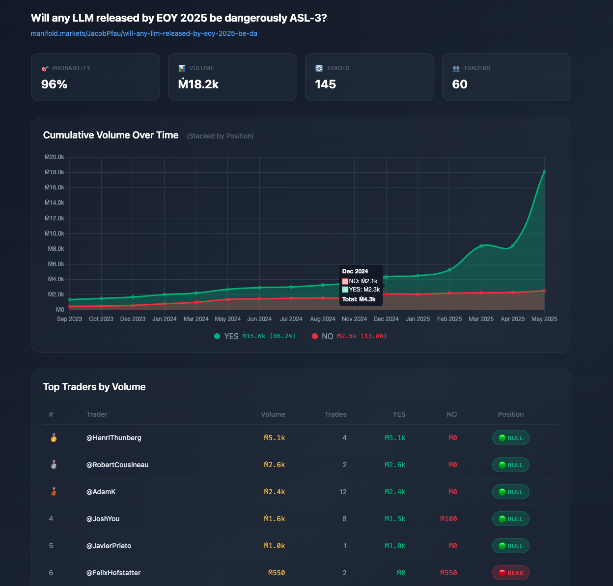

# Manifold Markets Analyzer

Analyze and visualize prediction market data from [Manifold Markets](https://manifold.markets). Fetches trade history via API, aggregates by trader and time period, and generates interactive HTML visualizations.

## Features

- **API Data Fetching**: Paginated fetching of all bets for any market
- **Trader Analytics**: Volume, trade count, YES/NO breakdown, bull/bear stance
- **Time Series**: Monthly cumulative volume charts
- **Interactive Visualizations**: Standalone HTML files with Chart.js

## Quick Start

### 1. Find a Market ID

Search for a market:
```bash
curl "https://api.manifold.markets/v0/search-markets?term=your+search+term"
```

Or grab from the URL - the market ID is in the API response.

### 2. Fetch Market Data

```bash
python3 scripts/fetch_market_data.py --market-id MARKET_ID --output all > market_data.json
```

Options:
- `--output all` - Summary, traders, monthly, last 100 trades
- `--output json` - Full data including all trades
- `--output traders` - Just trader leaderboard
- `--output monthly` - Just monthly aggregates

### 3. Resolve Usernames (Optional)

The API returns user IDs, not names. To resolve top traders:

```python
import json
from urllib.request import urlopen

def get_username(user_id):
    url = f"https://api.manifold.markets/v0/user/by-id/{user_id}"
    return json.loads(urlopen(url).read())['username']
```

**Note**: Be conservative with API calls - add 1 second delays between requests.

### 4. Create Visualization

Use one of the example HTML files as a template:
- `iran_market_viz_chartjs.html` - Binary YES/NO market
- `ai_imo_gold_viz.html` - Long-running market with many months
- `agi_2030_viz.html` - Medium-sized market

## Example Markets Analyzed

| Market | Probability | Volume | File |
|--------|-------------|--------|------|
| Iran Regime Fall 2026 | 39% | Ṁ1.71M | `iran_market_viz_chartjs.html` |
| AI IMO Gold 2025 | 97% | Ṁ7.85M | `ai_imo_gold_viz.html` |
| AGI Before 2030 | 31% | Ṁ133k | `agi_2030_viz.html` |

## Project Structure

```
manifold-analysis/
├── scripts/
│   ├── fetch_market_data.py    # API fetcher with pagination
│   └── parse_trades.py         # Parse text/CSV trade data
├── examples/
│   ├── asl3_danger_data.json   # Example: ASL-3 market data
│   ├── asl3_danger_usernames.json
│   └── asl3_danger_viz.html    # Example visualization
├── references/
│   └── visualization_template.md   # React/Recharts template
├── SKILL.md                    # Claude Code skill definition
├── *_viz.html                  # Generated visualizations
└── *_data.json                 # Cached market data (gitignored)
```

## Example: ASL-3 Danger Market

The `examples/` folder contains a complete worked example:



```bash
# The data is already fetched - just open the visualization
open examples/asl3_danger_viz.html
```

Market: "Will any LLM released by EOY 2025 be dangerously ASL-3?"
- 145 trades, 60 traders, Ṁ18k volume
- Shows how data flows from API → JSON → HTML viz

## API Reference

### Endpoints Used

| Endpoint | Purpose |
|----------|---------|
| `GET /v0/search-markets?term=X` | Find markets by keyword |
| `GET /v0/market/{id}` | Get market details |
| `GET /v0/bets?contractId=X&limit=1000` | Get bets (paginated) |
| `GET /v0/user/by-id/{id}` | Resolve user ID to username |

### Rate Limiting

Be nice to the API:
- 1 second between paginated bet requests
- 0.5-1 second between user lookups
- Consider skipping bulk user resolution for large markets

## Visualization Features

The generated HTML files include:

- **Stats Cards**: Probability, volume, trades, unique traders
- **Stacked Area Chart**: Cumulative YES/NO volume over time
- **Trader Leaderboard**: Top 20 by volume with stance indicators
- **Responsive Design**: Works on mobile
- **Dark Theme**: Easy on the eyes

## Claude Code Skill

This repo includes a skill definition (`SKILL.md`) that enables Claude Code to:

1. Fetch market data from any Manifold URL
2. Process and aggregate trade history
3. Generate interactive visualizations
4. Identify key traders and market dynamics

Trigger phrases:
- "Analyze this Manifold market: [URL]"
- "Show me the traders on [market name]"
- "Create a visualization for [market]"

## Tech Stack

- **Python 3**: Data fetching and processing
- **Chart.js 4.x**: Interactive charts (CDN loaded)
- **Vanilla HTML/CSS/JS**: No build step required

## License

MIT
